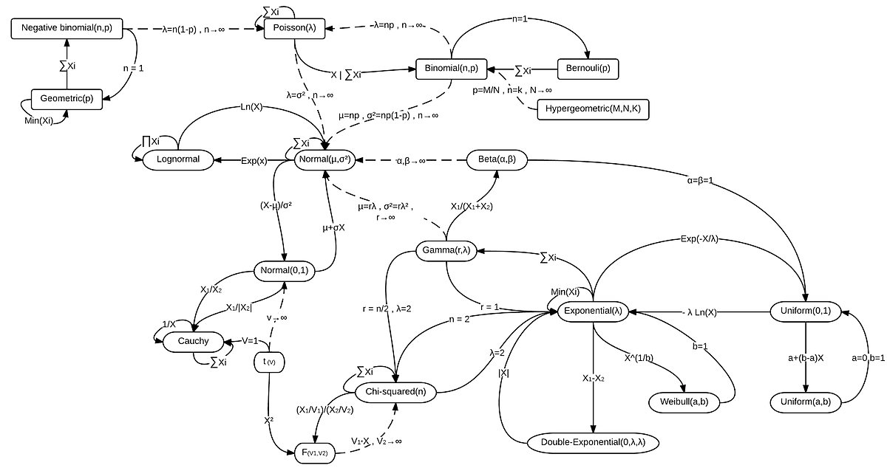

# Statistics and ML

* Distribution, distribution, distribution!
  * 
* Stochastic Gradient Descent as Approximate Bayesian Inference
  * https://arxiv.org/abs/1704.04289

* Brief Introduction to Information Geometry
  * https://arxiv.org/abs/1410.3369
  * https://en.wikipedia.org/wiki/Statistical_manifold
* Use of Stat/Info Geo in ML
  * http://eprints.whiterose.ac.uk/129178/1/LTTR-final-accepted.pdf
  
